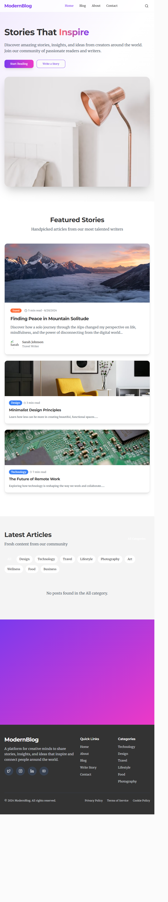

# ModernBlog

A modern, responsive blog application built with React, TypeScript, Express, and Tailwind CSS.



## 🚀 Features

- **Modern Design**: Clean, minimalist interface with smooth animations
- **Responsive Layout**: Works perfectly on desktop, tablet, and mobile devices
- **Featured Stories**: Highlight your best content with beautiful featured sections
- **Search Functionality**: Built-in search overlay for easy content discovery
- **Category Filtering**: Organize content with tags like Design, Technology, Travel, etc.
- **Smooth Animations**: Enhanced user experience with Framer Motion animations
- **TypeScript**: Full type safety throughout the application

## 🛠️ Tech Stack

- **Frontend**: React 18, TypeScript, Tailwind CSS, Framer Motion
- **Backend**: Express.js, Node.js
- **Database**: Drizzle ORM with Neon PostgreSQL
- **Styling**: Tailwind CSS with custom design system
- **Icons**: Lucide React
- **Build Tools**: Vite, ESBuild

## 📸 Screenshots

### Homepage
Beautiful hero section with inspiring content discovery

### Featured Stories
Handpicked articles with stunning visuals

### Category Filtering
Easy content organization and discovery

## 🚀 Getting Started

### Prerequisites

- Node.js 18+ 
- npm or yarn
- PostgreSQL database (or Neon account)

### Installation

1. Clone the repository:
```bash
git clone https://github.com/gabrielANASH/modern-blog.git
cd modern-blog
```

2. Install dependencies:
```bash
npm install
```

3. Set up your environment variables:
```bash
# Copy and configure your database URL
DATABASE_URL=your_database_url_here
```

4. Run database migrations:
```bash
npm run db:push
```

5. Start the development server:
```bash
npm run dev
```

6. Open your browser and visit `http://localhost:5000`

## 📁 Project Structure

```
modern-blog/
├── client/                 # React frontend
│   ├── src/
│   │   ├── components/     # Reusable UI components
│   │   ├── pages/          # Page components
│   │   ├── hooks/          # Custom React hooks
│   │   └── lib/            # Utilities and configurations
├── server/                 # Express backend
│   ├── index.ts           # Server entry point
│   ├── routes.ts          # API routes
│   └── storage.ts         # Database operations
└── shared/                # Shared types and schemas
```

## 🎨 Design Features

- **Electric Purple** accent color (#7C3AED)
- **Smooth hover animations** for interactive elements
- **Glass-morphism effects** in navigation
- **Responsive grid layouts** for content
- **Beautiful typography** with modern font pairings

## 🚀 Deployment

The application is ready for deployment on platforms like:

- **Vercel** (Recommended for full-stack apps)
- **Netlify** (Frontend) + **Railway** (Backend)
- **Heroku**
- **DigitalOcean App Platform**

## 🤝 Contributing

1. Fork the repository
2. Create your feature branch (`git checkout -b feature/amazing-feature`)
3. Commit your changes (`git commit -m 'Add amazing feature'`)
4. Push to the branch (`git push origin feature/amazing-feature`)
5. Open a Pull Request

## 📝 License

This project is open source and available under the [MIT License](LICENSE).

## 🙏 Acknowledgments

- Design inspiration from modern blog platforms
- Icons by [Lucide](https://lucide.dev/)
- UI components inspired by [shadcn/ui](https://ui.shadcn.com/)

---

Made with ❤️ by [Gabriel](https://github.com/gabrielANASH)
